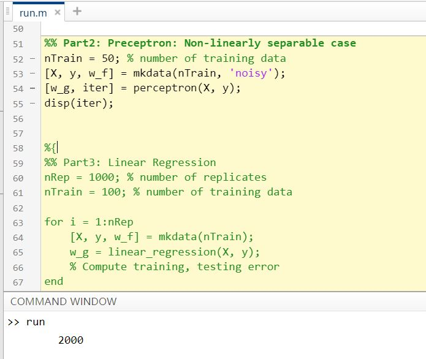

# HW2 

### 线性回归 A Walk Through Linear Models
   In this problem, you will implement a whole bunch of linear classifiers and compare their performance and properties.
We assume our target function is 


   In each run, choose a random line in the plane as your target function f, where one side of the line maps to +1and the other maps to -1.   
   Skeleton code and MATLAB functions including mkdata and plotdata are given for your convenience, see the comments in the code for more details. What you need to do is implementing each algorithm and write scripts to play with them. Your algorithm implementations should be able to handle data in arbitrary dimension. For most of the questions below, you should repeat the experiments for 1000 times and take the average. See run.m for a script example.   
   Hint: Do not forget to add the bias constant term!  

####  (a) perceptron

- ###### Question:
   Implement Perceptron learning algorithm (in perceptron.m), then answer the following questions.   
   (i) What is the training error rate and expected testing error rate (we can generate a large set of testing points to estimate test error), when the size of training set is 10 and 100 respectly?   
   (ii) What is the average number of iterations before your algorithm converges when the size of training set is 10 and 100 respectively ?  
   (iii) What will happen if the training data is not linearly separable (Use mkdata(N,’noisy’) to generate non-linearly separable data) ?  

- ###### Answer:
   (i)  Error: 
        
   10：E_train: 0.000000 E_test: 0.408300
   
   100：E_train: 0.000700 E_test: 0.406150          
   (ii)   Average number of iterations(截图请看上图) : 
   10:  13  
   100: 178  
   (iii) non-linearly separable data：
    
   
   If the training data is not linearly separable, the perceptron learning algorithm will eventually repeat the same set of weights and therefore enter an infinite loop. 从图中可以看出没有结束，直到达到了ttl的次数才强制结束。      

- ###### function_perceptron:
```matlab
function [w, iter] = perceptron(X, y)
% Perceptron Learning Algorithm.
%
%   INPUT:  X: training sample features, P-by-N matrix.
%           y: training sample labels, 1-by-N row vector.
%
%   OUTPUT: w: learned perceptron parameters, (P+1)-by-1 column vector.
%           iter: number of iterations
%

% YOUR CODE HERE
[P, N] = size(X);       % get size of X
X = [ones(1, N); X];    % add 1 dimension to X for w0           
w = ones(P+1, 1);       % weight
d = zeros(1, N);        % judge: (w' * X(:, i)).* y(i)

iter = 0;               % train times: in case of infinity
ok = 0;                 % test if all (w' * X(:, i)).* y(i) > 0, means right predict label

while(ok == 0 && iter ~= 2000)
    iter = iter+1;
    for i=1:N
        d(i) = (w' * X(:, i)).* y(i);   % judge
        if  d(i) <= 0                   % wrong predict    
            w = w + X(:, i) .* y(i);    % adjust weight
            break;
        end
    end
    if d(:) > 0    % all predict correct, then end training
        ok = 1;
    end
end
```

- ###### run:
```matlab
nRep = 1000;      % number of replicates
nTrain = 100;     % number of training data
nTest = 100;      % number of training data

E_train = 0;     % training error rate
E_test = 0;      % test error rate
iter_sum = 0;    % sum of iter

for i = 1:nRep
    [X, y, w_f] = mkdata(nTrain);
    [w_g, iter] = perceptron(X, y);
    
    [P, N] = size(X);       % get size of X
    predict = zeros(1, N);  % predict: w' * X
    % Compute training error
    X_train = [ones(1, N); X];    % add 1 dimension to X for w0
    predict = w_g' * X_train;     % predict label
    for j = 1:N
        if (predict(j) * y(j)) < 0     % predict wrong
            E_train = E_train + 1;
        end
    end
    % Compute testing error
    [X_test, y_test, w_f_test] = mkdata(nTest);
    X_test = [ones(1, N); X_test];    % add 1 dimension to X for w0
    predict = w_g' * X_test;     % predict label
    for j = 1:N
        if (predict(j) * y_test(j)) < 0     % predict wrong
            E_test = E_test + 1;
        end
    end
    % Sum up number of iterations
    iter_sum = iter_sum + iter;
end

E_train = E_train / (nRep * nTrain);
E_test = E_test / (nRep * nTest);
avgIter = iter_sum / nRep;

fprintf('E_train is %f, E_test is %f.\n', E_train, E_test);
fprintf('Average number of iterations is %d.\n', avgIter);
plotdata(X, y, w_f, w_g, 'Pecertron');
```

- ###### 思路：
   
当di都大于0的时候，也就是说所有分组都是正确的时候，就可以结束training了

- ###### 理论解释：


- ###### 实现步骤：


- ###### 公式：


- ###### Batch Percetron：


- ###### Reference：
Reference Links：     
https://blog.csdn.net/u010545732/article/details/20802149    
https://www.zybuluo.com/hanbingtao/note/433855        

Reference Code：   
www.ilovematlab.cn/thread-44920-1-1.html   
https://blog.csdn.net/liuzhuomei0911/article/details/51585765    


### (b) Linear Regression：
- ###### Question

   Implement Linear Regression (in linear_regression.m), then answer the following questions.    
   Note that we use Linear Regression here to classify data points. This technique is called Linear Regression on indicator response matrix1.     
   (i) What is the training error rate and expected testing error rate if the size of training set is 100 ?
   (ii) What is the training error rate and expected testing error rate if the training data is noisy and not linearly separable (nTrain = 100) ?
   (iii) Run Linear Regression on dataset poly_train.mat. What is the training error rate? What is the testing error rate on poly_test.mat ?
   (iv) Do the following data transformation
   
   on dataset poly_train.mat. After this transformation, what is the training error rate? What is the testing error rate on poly_test.mat ?

- ###### function_linear:
```matlab
function w = linear_regression(X, y)
%LINEAR_REGRESSION Linear Regression.
%
%   INPUT:  X: training sample features, P-by-N matrix.
%           y: training sample labels, 1-by-N row vector.
%
%   OUTPUT: w: learned perceptron parameters, (P+1)-by-1 column vector.
%

% YOUR CODE HERE
[P, N] = size(X);       
X = [ones(1, N); X];    % add 1 dimension to X for w0

w = pinv(X * X') * X * y';

end
```

- ###### run：
```matlab
nRep = 1000; % number of replicates
nTrain = 100; % number of training data

for i = 1:nRep
    [X, y, w_f] = mkdata(nTrain);
    w_g = linear_regression(X, y);
    % Compute training, testing error
end

%fprintf('E_train is %f, E_test is %f.\n', E_train, E_test);
plotdata(X, y, w_f, w_g, 'Linear Regression');
```

Linear Regression on indicator response matrix：  
http://books.google.com/books?id=VRzITwgNV2UC&pg=PA81

- ###### 公式：


 

 

 

 

 

 

 