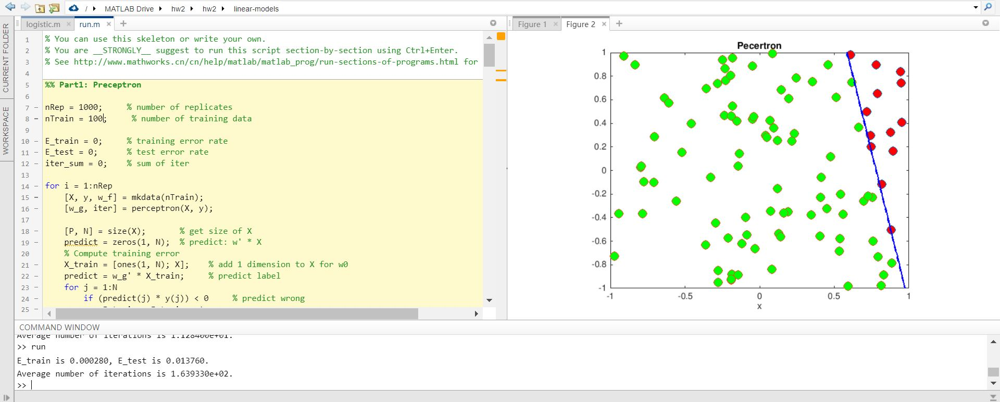
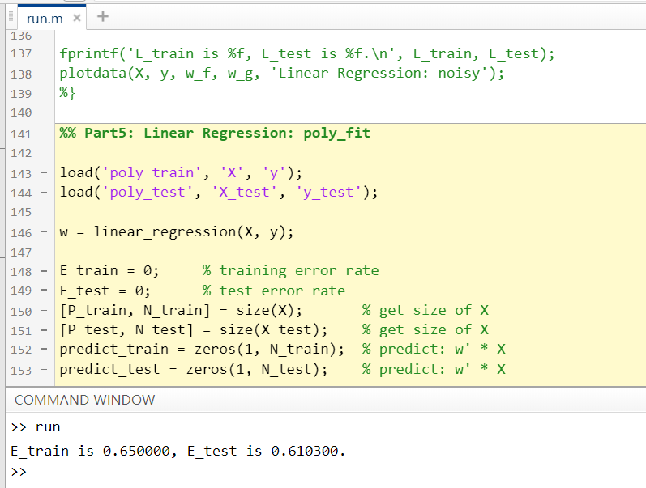
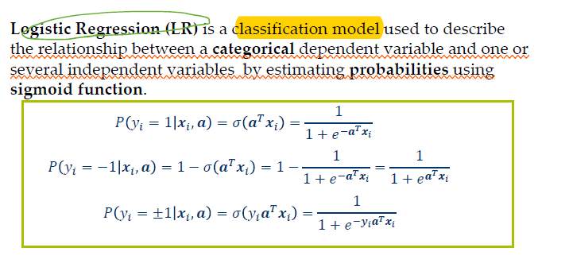
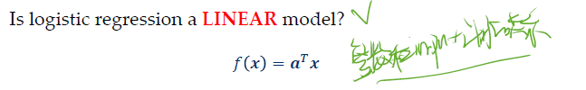

# HW2 

### 线性回归 A Walk Through Linear Models
   In this problem, you will implement a whole bunch of linear classifiers and compare their performance and properties.
We assume our target function is 


   In each run, choose a random line in the plane as your target function f, where one side of the line maps to +1and the other maps to -1.   
   Skeleton code and MATLAB functions including mkdata and plotdata are given for your convenience, see the comments in the code for more details. What you need to do is implementing each algorithm and write scripts to play with them. Your algorithm implementations should be able to handle data in arbitrary dimension. For most of the questions below, you should repeat the experiments for 1000 times and take the average. See run.m for a script example.   
   Hint: Do not forget to add the bias constant term!  
   TIP：实线是训练集正确的权重w_f显示，虚线是训练后得出的权重w_g，从而从图中可以大致看出训练是否正确。

#### mktestdata.m
在本题中首先需要实现test data的生成，在此需要注意使用了train data相同的分布函数即相同的w来生成test data。
```matlab
function [X, y] = mktestdata(N, w)
%MKDATA Generate data set.
%
%   INPUT:  N: number of samples.
%           w: target function parameters, (P+1)-by-1 column vector.
%
%   OUTPUT: X: sample features, P-by-N matrix.
%           y: sample labels, 1-by-N row vector.
%           


range = [-1, 1];
dim = 2;

X = rand(dim, N)*(range(2)-range(1)) + range(1); 
while true  
  y = sign(w'*[ones(1, N); X]);
  if all(y)
      break; 
  end
end

end
```

####  (a) perceptron

- ###### Question:
   Implement Perceptron learning algorithm (in perceptron.m), then answer the following questions.   
   (i) What is the training error rate and expected testing error rate (we can generate a large set of testing points to estimate test error), when the size of training set is 10 and 100 respectly?   
   (ii) What is the average number of iterations before your algorithm converges when the size of training set is 10 and 100 respectively ?  
   (iii) What will happen if the training data is not linearly separable (Use mkdata(N,’noisy’) to generate non-linearly separable data) ?  

- ###### Answer:
   (i)  Error: 
        
   10：E_train: 0.000000 E_test: 0.011480
   
   100：E_train: 0.000280 E_test: 0.013760          
   (ii)   Average number of iterations(截图请看上图) : 
   10:  11  
   100: 163  
   (iii) non-linearly separable data：
    
   
   If the training data is not linearly separable, the perceptron learning algorithm will eventually repeat the same set of weights and therefore enter an infinite loop. 从图中可以看出没有结束，直到达到了ttl的次数才强制结束。      

- ###### function_perceptron:
```matlab
function [w, iter] = perceptron(X, y)
% Perceptron Learning Algorithm.
%
%   INPUT:  X: training sample features, P-by-N matrix.
%           y: training sample labels, 1-by-N row vector.
%
%   OUTPUT: w: learned perceptron parameters, (P+1)-by-1 column vector.
%           iter: number of iterations
%

% YOUR CODE HERE
[P, N] = size(X);       % get size of X
X = [ones(1, N); X];    % add 1 dimension to X for w0           
w = ones(P+1, 1);       % weight
d = zeros(1, N);        % judge: (w' * X(:, i)).* y(i)

iter = 0;               % train times: in case of infinity
ok = 0;                 % test if all (w' * X(:, i)).* y(i) > 0, means right predict label

while(ok == 0 && iter ~= 2000)
    iter = iter+1;
    for i=1:N
        d(i) = (w' * X(:, i)).* y(i);   % judge
        if  d(i) <= 0                   % wrong predict    
            w = w + X(:, i) .* y(i);    % adjust weight
            break;
        end
    end
    if d(:) > 0    % all predict correct, then end training
        ok = 1;
    end
end
```

- ###### run:
```matlab
nRep = 1000;     % number of replicates
nTrain = 100;     % number of training data
nTest = 100;     % number of test data

E_train = 0;     % training error rate
E_test = 0;      % test error rate
iter_sum = 0;    % sum of iter

for i = 1:nRep
    [X, y, w_f] = mkdata(nTrain);
    [w_g, iter] = perceptron(X, y);
    
    % Compute training error
    X_train = [ones(1, nTrain); X];    % add 1 dimension to X for w0
    predict = w_g' * X_train;     % predict label
    for j = 1:nTrain
        if (predict(j) * y(j)) < 0     % predict wrong
            E_train = E_train + 1;
        end
    end
    % Compute testing error
    [X_test, y_test] = mktestdata(nTest, w_f);
    X_test = [ones(1, nTest); X_test];    % add 1 dimension to X for w0
    predict = w_g' * X_test;     % predict label
    for j = 1:nTest
        if (predict(j) * y_test(j)) < 0     % predict wrong
            E_test = E_test + 1;
        end
    end
    % Sum up number of iterations
    iter_sum = iter_sum + iter;
end

E_train = E_train / (nRep * nTrain);
E_test = E_test / (nRep * nTest);
avgIter = iter_sum / nRep;

fprintf('E_train is %f, E_test is %f.\n', E_train, E_test);
fprintf('Average number of iterations is %d.\n', avgIter);
plotdata(X, y, w_f, w_g, 'Pecertron');
```

- ###### 思路：
     
  当di都大于0的时候，也就是说所有分组都是正确的时候，就可以结束training了  
    
- ###### 理论解释：
  

- ###### 实现步骤：
  


- ###### 公式：


- ###### Batch Percetron：


- ###### Reference：
   Reference Links：     
   https://blog.csdn.net/u010545732/article/details/20802149    
   https://www.zybuluo.com/hanbingtao/note/433855        

   Reference Code：   
   www.ilovematlab.cn/thread-44920-1-1.html   
   https://blog.csdn.net/liuzhuomei0911/article/details/51585765    
### (b) Linear Regression：
- #### Question

   Implement Linear Regression (in linear_regression.m), then answer the following questions.    
   Note that we use Linear Regression here to classify data points. This technique is called Linear Regression on indicator response matrix1.     
   (i) What is the training error rate and expected testing error rate if the size of training set is 100 ?
   (ii) What is the training error rate and expected testing error rate if the training data is noisy and not linearly separable (nTrain = 100) ?
   (iii) Run Linear Regression on dataset poly_train.mat. What is the training error rate? What is the testing error rate on poly_test.mat ?
   (iv) Do the following data transformation
   
   on dataset poly_train.mat. After this transformation, what is the training error rate? What is the testing error rate on poly_test.mat ?

- #### Answer：

   (i) Part3: Linear Regression:   
     
   100：E_train: 0.039280 E_test: 0.047610          
   (ii) Part4:  Linear Regression: noisy:  
     
   100：E_train: 0.136460 E_test: 0.062500  
   训练的时候not linearly separable的误差会比linearly separable的大。   
   (iii) Part5: Linear Regression: poly_fit  
       
   E_train: 0.650000  
   E_test: 0.610300  
   (iv)   
     
     
```matlab
   X_t = [X; X(1,:).*X(2, :); X(1, :).^2; X(2, :).^2];
```
   E_train: 0.050000  
   E_test: 0.066000

- #### function_linear:
```matlab
function w = linear_regression(X, y)
%LINEAR_REGRESSION Linear Regression.
%
%   INPUT:  X: training sample features, P-by-N matrix.
%           y: training sample labels, 1-by-N row vector.
%
%   OUTPUT: w: learned perceptron parameters, (P+1)-by-1 column vector.
%

% YOUR CODE HERE
[P, N] = size(X);       
X = [ones(1, N); X];    % add 1 dimension to X for w0

w = pinv(X * X') * X * y';

end
```

- #### run： 
(i)   
```matlab
%% Part3: Linear Regression
nRep = 1000; % number of replicates
nTrain = 100; % number of training data
nTest = 100; % number of test data

E_train = 0;     % training error rate
E_test = 0;      % test error rate

for i = 1:nRep
    [X, y, w_f] = mkdata(nTrain);
    w_g = linear_regression(X, y);

    % Compute training error
    X_train = [ones(1, nTrain); X];    % add 1 dimension to X for w0
    predict = w_g' * X_train;     % predict label
    for j = 1:nTrain
        if (predict(j) * y(j)) < 0     % predict wrong
            E_train = E_train + 1;
        end
    end
    % Compute testing error
    [X_test, y_test] = mktestdata(nTest, w_f);
    X_test = [ones(1, nTest); X_test];    % add 1 dimension to X for w0
    predict = w_g' * X_test;     % predict label
    for j = 1:nTest
        if (predict(j) * y_test(j)) < 0     % predict wrong
            E_test = E_test + 1;
        end
    end
end

E_train = E_train / (nRep * nTrain);
E_test = E_test / (nRep * nTest);

fprintf('E_train is %f, E_test is %f.\n', E_train, E_test);
plotdata(X, y, w_f, w_g, 'Linear Regression');
```

Linear Regression on indicator response matrix：  
http://books.google.com/books?id=VRzITwgNV2UC&pg=PA81

- #### 公式：   
     
        
     
      
     
     

### (c) Logistic Regression
- #### Question:
   Implement Logistic Regression (in logistic.m), then answer the following questions. Remember the form of Logistic Regression  
     
   Let us assume  
   
   then   
     
   Now you can learn your logistic model using MLE. Not like Linear Regression, we have no closed-form solution to solve the MLE problem. So you should use gradient descent to maximize the log-likelihood function iteratively.  
   Derive the gradient descent update rule, choose a proper learning rate, and repeat the experiment for 100 times to take average.  
   (i) What is the training error rate and expected testing error rate if the size of training set is 100 ?  
   (ii) What is the training error rate and expected testing error rate if the training data is noisy and not linearly separable (nTrain = 100) ?  

- #### Answer  
   本题的题目中提到分类为y=0/1,但是在实际数据中y=-1/1，所以在本题的logistics function中将所有-1转化成为了0。同时在训练的时候由于仍然存在误差，因此将predict-0.5的正负来判断是否判断正确。  
   (i) Part6: Logistic Regression   
     
   100：E_train: 0.005300 E_test: 0.015100   
   (ii) Part7: Logistic Regression: noisy   
     
   E_train: 0.253801 E_test: 0.102477  
   
- #### function_logistic:
```matlab
function w = logistic(X, y)
%LR Logistic Regression.
%
%   INPUT:  X:   training sample features, P-by-N matrix.
%           y:   training sample labels, 1-by-N row vector.
%
%   OUTPUT: w    : learned parameters, (P+1)-by-1 column vector.
%

% YOUR CODE HERE

y = (y == 1);

[P, N] = size(X);       
X = [ones(1, N); X];    % add 1 dimension to X for w0
w = rand(P+1, 1);

iter = 0;
stop_iter = 1000;
stop_loss = 0;
learning_rate = 0.02;

h = 1 ./ (1 + exp(-1 * w' * X));    % sigmoid function: 1 * N
loss = -(1 / N) * (y * log(h)' + (1 - y) * log(1 - h)');    % loss value

while(loss >= stop_loss && iter <= stop_iter)
    gradient = X * (h - y)';       % gradient: P+1 * 1;
    w = w - learning_rate * gradient;   % update weight: 1 * N
    h = 1.0 ./ (1 + exp(-1.0 * w' * X));    % update h
    loss = -(1.0 / N) * (y * log(h)' + (1 - y) * log(1 - h)');    % update loss
    iter = iter + 1;
end

end
```

- #### run:
```matlab
nRep = 100; % number of replicates
nTrain = 100; % number of training data
nTest = 100; % number of test data

E_train = 0;     % training error rate
E_test = 0;      % test error rat

for i = 1:nRep
    [X, y, w_f] = mkdata(nTrain);
    w_g = logistic(X, y);
    % compute training error
    E_train = E_train + sum(sign(w_g' * [ones(1,nTrain); X]) ~= y);
  
    [X_test, y_test] = mktestdata(nTest, w_f);
    % compute training error
    E_test = E_test + sum(sign(w_g' * [ones(1,nTest); X_test]) ~= y_test);
end

E_train = E_train / (nRep * nTrain);
E_test = E_test / (nRep * nTest);


fprintf('E_train is %f, E_test is %f.\n', E_train, E_test);
plotdata(X, y, w_f, w_g, 'Logistic Regression');
```

   - ####   实现步骤  
     在本题中实际的y是-1or1的，但是题目采用y=0or1来代表两个分类，本质上没有区别，只是公式存在不同。但是因为是根据题目写了logistics的公式，所以对y进行了转化，-1都变为0。
     主要思路就是首先通过概率函数利用极大值似然估计来求出反梯度方向从而用来更新weight，然后用更新后的weight来重新计算loss，如果符合精度则结束训练，否则继续循环训练。   

     其中loss的1/N应该是因为数据量越大的时候肯定loss的绝对值更大，所以取个平均

      

     两组y=0 or 1时：  
     https://blog.csdn.net/xiaoxiangzi222/article/details/55097570
     
     
     
       

   - ##### Sigmoid Function：  

       
       
     <https://blog.csdn.net/programmer_wei/article/details/52072939> 

   - ##### Maximum Likelihood Estimation：
     两组y=+-1时：  
     一般说来，事件A发生的概率与某一未知参数  有关，  取值不同，则事件A发生的概率  也不同，当我们在一次试验中事件A发生了，则认为此时的  值应是t的一切可能取值中使  达到最大的那一个，极大似然估计法就是要选取这样的t值作为参数t的估计值，使所选取的样本在被选的总体中出现的可能性为最大。  
       
       
       

  - ##### Gradient Descent:              
       https://blog.csdn.net/programmer_wei/article/details/51941358 
            
            

- #### Linear Regression 和 Logistic Regression的区别：

   上课的时候说logistic regression 也是linear model
     
   线性回归要求因变量必须是连续性数据变量；逻辑回归要求因变量必须是分类变量，二分类或者多分类的；比如要分析性别、年龄、身高、饮食习惯对于体重的影响，如果这个体重是属于实际的重量，是连续性的数据变量，这个时候就用线性回归来做；如果将体重分类，分成了高、中、低这三种体重类型作为因变量，则采用logistic回归。   
   逻辑回归又称logistic回归分析，是一种广义的线性回归分析模型，常用于数据挖掘，疾病自动诊断，经济预测等领域。例如，探讨引发疾病的危险因素，并根据危险因素预测疾病发生的概率等。以胃癌病情分析为例，选择两组人群，一组是胃癌组，一组是非胃癌组，两组人群必定具有不同的体征与生活方式等。  
   线性回归是利用数理统计中回归分析，来确定两种或两种以上变量间相互依赖的定量关系的一种统计分析方法，运用十分广泛。其表达形式为y = w'x+e，e为误差服从均值为0的正态分布。回归分析中，只包括一个自变量和一个因变量，且二者的关系可用一条直线近似表示，这种回归分析称为一元线性回归分析。   
   在统计学中，线性回归(Linear Regression)是利用称为线性回归方程的最小平方函数对一个或多个自变量和因变量之间关系进行建模的一种回归分析。这种函数是一个或多个称为回归系数的模型参数的线性组合。只有一个自变量的情况称为简单回归,大于一个自变量情况的叫做多元回归。   
   <https://zhidao.baidu.com/question/758096561928935564.html>  

   逻辑回归：y=sigmoid(w'x)   
   线性回归：y=w'x  
   逻辑回归比线性回归多了一个sigmoid函数，sigmoid(x)=1/(1+exp(-x))，是对x进行归一化操作，使得sigmoid(x)位于0~1   
   逻辑回归通常用于二分类模型，目标函数是二类交叉熵，y的值表示属于第1类的概率，用户可以自己设置一个分类阈值。   
   线性回归用来拟合数据，目标函数是平法和误差   
   <https://zhidao.baidu.com/question/584983091084171925.html>

   1）线性回归要求变量服从正态分布，logistic回归对变量分布没有要求。   
   2）线性回归要求因变量是连续性数值变量，而logistic回归要求因变量是分类型变量。   
   3）线性回归要求自变量和因变量呈线性关系，而logistic回归不要求自变量和因变量呈线性关系   
   4）logistic回归是分析因变量取某个值的概率与自变量的关系，而线性回归是直接分析因变量与自变量的关系   
   总之, logistic回归与线性回归实际上有很多相同之处，最大的区别就在于他们的因变量不同，其他的基本都差不多，正是因为如此，这两种回归可以归于同一个家族，即广义线性模型（generalized linear model）。这一家族中的模型形式基本上都差不多，不同的就是因变量不同，如果是连续的，就是多重线性回归，如果是二项分布，就是logistic回归。logistic回归的因变量可以是二分类的，也可以是多分类的，但是二分类的更为常用，也更加容易解释。所以实际中最为常用的就是二分类的logistic回归。  
   <https://blog.csdn.net/gcs1024/article/details/77478404>

### SVM
- #### Question
  Implement Support Vector Machine without introducing slack variables (in svm.m), then answer the following questions.  
  Hint: Using MATALB built-in function quadprog, you should be able to implement SVM in less than 10 lines of code.   
  (i) What is the training error rate and expected testing error rate if the size of training set is 30 ? (Use plotdata to plot your learnt model, hope the graph will help you understand SVM as a maximum margin classifier.)   
  (ii) What is the training error rate and expected testing error rate if the size of training set is 100 ?   
  (iii) For the case nTrain = 100, what is average number of support vectors in your trained SVM models?

- #### Answer
   (i) size 30:
   
   E_train: 0.031901 E_test: 0.031901
   (ii) size 100:

   

   E_train: 0.010920 E_test: 0.010920

   (iii) 

   Average number of support vectors is 3.507000

- #### function_svm
```matlab
function [w, num] = svm(X, y)
%SVM Support vector machine.
%
%   INPUT:  X: training sample features, P-by-N matrix.
%           y: training sample labels, 1-by-N row vector.
%
%   OUTPUT: w:    learned perceptron parameters, (P+1)-by-1 column vector.
%           num:  number of support vectors
%

% YOUR CODE HERE

[P, N] = size(X);
X = [ones(1, N); X];
w = quadprog(eye(P+1), [], -diag(y)*(X'), -ones(N,1));    % weight

d = y .* (w' * X);
num = sum(abs(d - 1) < 0.01);

end
```

- #### run
```matlab
nRep = 1000; % number of replicates
nTrain = 30; % number of training data
nTest = 30; % number of test data

number = 0;

for i = 1:nRep
    [X, y, w_f] = mkdata(nTrain);
    [w_g, num_sc] = svm(X, y);
    % Compute training error
    E_train = E_train + sum(y .* (w_g' * [ones(1,nTrain); X]) < 1);
    
    [X_test, y_test] = mktestdata(nTest, w_f);
    % Compute testing error
    E_test = E_test + sum(y .* (w_g' * [ones(1,nTrain); X]) < 1);
    % Sum up number of support vectors
    number = number + num_sc;
end

E_train = E_train / (nRep * nTrain);
E_test = E_test / (nRep * nTest);

number = number / nRep;

fprintf('E_train is %f, E_test is %f.\n', E_train, E_test);
fprintf('Average number of support vectors is %f.\n', number);
plotdata(X, y, w_f, w_g, 'SVM');
```


- #### 理论实现
   - 实现步骤
       
     使得两个距离最近的点，离平面也最远，取中垂线。  
       
       
       
       
     也就是求min||w||,采用二次规划方法matlab中的quadprog函数（https://blog.csdn.net/u011090298/article/details/41990827） 来解决这个问题。  
       
      

   - Support Vector

     

   

### Summary  
  
   
  
  


