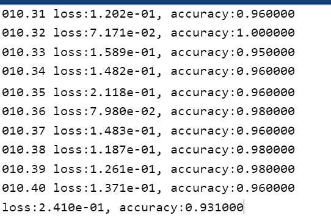

# HW3

## 1. Neural Networks

## 2. K-Nearest Neighbor

(a)

- k=1:

- k=10:

- k=100:

  

(b) We can split the dataset into the training set and validation set. Then choose the K which performs best in the validation set.    

(c)

## 3. Decision Tree and ID3

### Question

Consider the scholarship evaluation problem: selecting scholarship recipients based on gender and GPA. Given the following training data:    

Draw the decision tree that would be learned by ID3 algorithm and annotate each non-leaf node in the tree with the information gain attained by the respective split.  

### Answer

1. Entropy: 

- Gender:

  - 
    $$
    E(Female) = - \frac{105}{205}log(\frac{105}{205}) - \frac{100}{205}log(\frac{100}{205}) = 0.99957
    $$

  - 
    $$
    E(Male) = - \frac{95}{245}log(\frac{95}{245}) - \frac{150}{245}log(\frac{150}{245}) = 0.96333
    $$

  - 
    $$
    E(Gender) = \frac{205}{450} * E(Female) + \frac{245}{450} * E(Male) = 0.97984
    $$

- GPA:

  - 
    $$
    E(High) = - \frac{185}{235}log(\frac{185}{235}) - \frac{50}{235}log(\frac{50}{235}) = 0.74674
    $$

  - 
    $$
    E(Low) = - \frac{15}{215}log(\frac{15}{215}) - \frac{200}{215}log(\frac{200}{215}) = 0.36506
    $$

  - 
    $$
    E(GPA) = \frac{235}{450} * E(High) + \frac{215}{450} * E(Low) = 0.56438
    $$

- The Information Gain:
  
  - 
    $$
    Gain(S, Gender) = E0 - E(Gender) = E0 - 0.97984
    $$

  - $$
    Gain(S, GPA) = E0 - E(GPA) = E0 - 0.56438
    $$

- Therefore,  choose GPA as the first split criteria.

- High:

  - 
    $$
    E(High) = - \frac{185}{235}log(\frac{185}{235}) - \frac{50}{235}log(\frac{50}{235}) = 0.74674
    $$

  - 
    $$
    E(High_Female) = - \frac{95}{115}log(\frac{95}{115}) - \frac{20}{115}log(\frac{20}{115}) = 0.66658
    $$

  - 
    $$
    E(High_Male) = - \frac{90}{120}log(\frac{90}{120}) - \frac{30}{120}log(\frac{30}{120}) = 0.81128
    $$

  - 
    $$
    E(Gender) = \frac{115}{235} * E(High_Female) + \frac{120}{235} * E(High_Male) = 0.74047
    $$

- Low:

  - 
    $$
    E(Low) = - \frac{15}{215}log(\frac{15}{215}) - \frac{200}{215}log(\frac{200}{215}) = 0.36506
    $$

  - 
    $$
    E(Low_Female) = - \frac{10}{90}log(\frac{10}{90}) - \frac{80}{90}log(\frac{80}{90}) = 0.50326
    $$

  - 
    $$
    E(Low_Male) = - \frac{5}{125}log(\frac{5}{125}) - \frac{120}{125}log(\frac{120}{125}) = 0.24229
    $$

  - 
    $$
    E(Gender) = \frac{90}{215} * E(Low_Female) + \frac{125}{215} * E(Low_Male) = 0.35153
    $$

- The Information Gain:
  
  - 
    $$
    Gain(S_High, Gender) = E_High - E(High_Gender) = 0.0063
    $$

  - $$
    Gain(S_Low, GPA) = E_Low - E(Low_Gender) = 0.0135
    $$

- Decision Tree:

  

## 4. K-Means Clustering

(a)

- max

- min

(b) Similar to question (a), we can repeat many times to get a stable result using k-means.  

(c)

- k = 10:

- k = 20:

- k = 50:

(d)

- Original：

  

  

- 8:

  

- 16:

- 32:

  

  

