# Assignment 4

### 1. Spectral Clustering
（a) 
- Kmeans:

  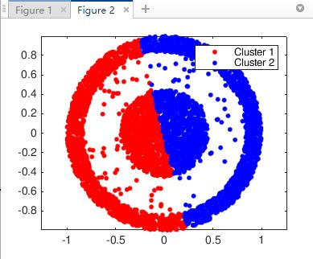

- Spectral Clustering:

  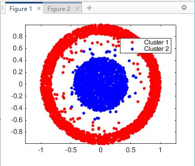

(b)

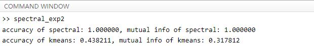

### 2. Principal Component Analysis

(a)
- The original image1:

  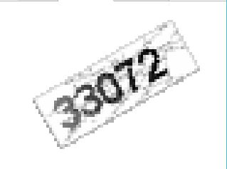

  

- The recovery image1:

  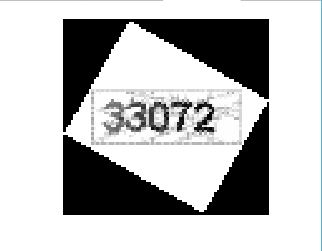

- The original image2:

  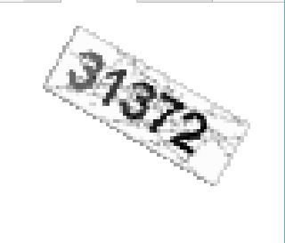

- The recovery image2:

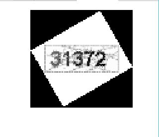

(b)

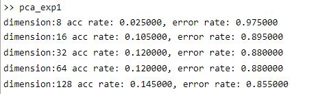

(c)

- The original image

  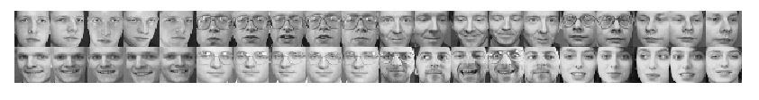

- dimension=8

  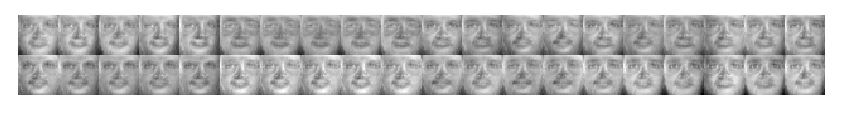

- dimension=16

  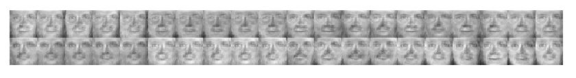

- dimension=32

  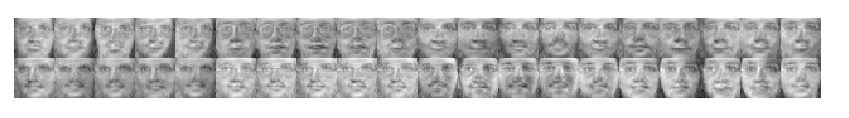

- dimension=64

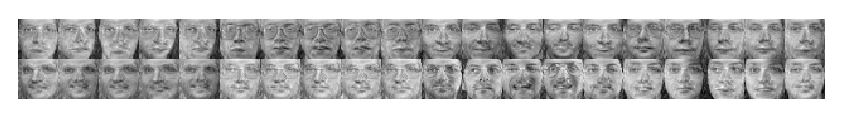

- dimension=128

  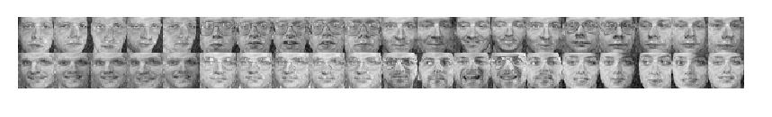

